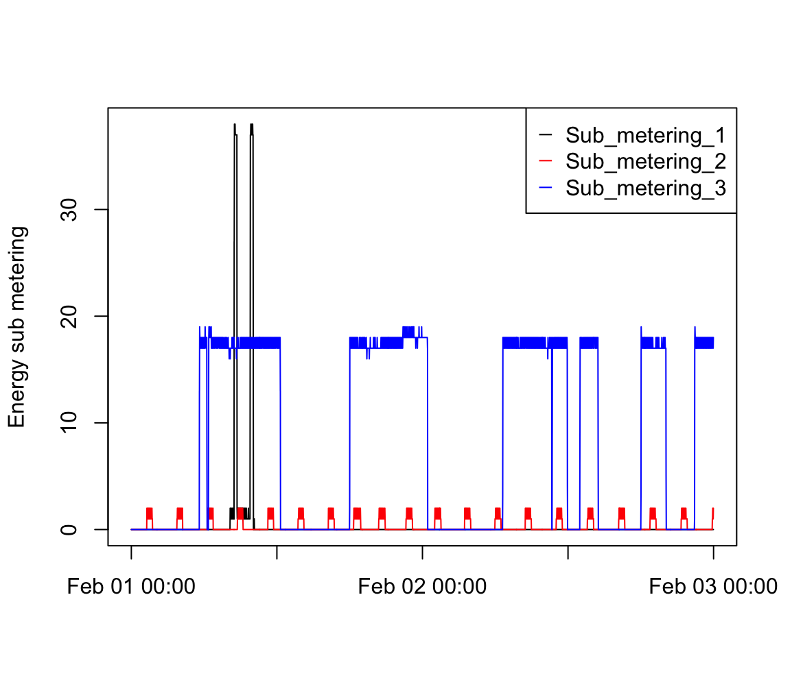

## Introduction

This assignment uses data from the [UC Irvine Machine Learning Repository](http://archive.ics.uci.edu/ml/), a popular repository for machine learning datasets. In particular, we will be using the "Individual household electric power consumption Data Set" which I have made available on the course web site:

* **Dataset**: [Electric power consumption](https://d396qusza40orc.cloudfront.net/exdata%2Fdata%2Fhousehold_power_consumption.zip) [20Mb]

* **Description**: Measurements of electric power consumption in one household with a one-minute sampling rate over a period of almost 4 years. Different electrical quantities and some sub-metering values are available.

The following descriptions of the 9 variables in the dataset are taken from the [UCI website](https://archive.ics.uci.edu/ml/datasets/Individual+household+electric+power+consumption):

1. **Date**: Date in format dd/mm/yyyy
2. **Time**: Time in format hh:mm:ss
3. **Global_active_power**: Household global minute-averaged active power (in kilowatt)
4. **Global_reactive_power**: Household global minute-averaged reactive power (in kilowatt)
5. **Voltage**: Minute-averaged voltage (in volt)
6. **Global_intensity**: Household global minute-averaged current intensity (in ampere)
7. **Sub_metering_1**: Energy sub-metering No. 1 (in watt-hour of active energy). It corresponds to the kitchen, containing mainly a dishwasher, an oven, and a microwave (hot plates are not electric but gas powered).
8. **Sub_metering_2**: Energy sub-metering No. 2 (in watt-hour of active energy). It corresponds to the laundry room, containing a washing machine, a tumble-dryer, a refrigerator, and a light.
9. **Sub_metering_3**: Energy sub-metering No. 3 (in watt-hour of active energy). It corresponds to an electric water heater and an air-conditioner.

## Loading the Data

When loading the dataset into R, please consider the following:

* The dataset has 2,075,259 rows and 9 columns. First, calculate a rough estimate of how much memory the dataset will require in memory before reading into R. Make sure your computer has enough memory (most modern computers should be fine).
* We will only be using data from the dates 2007-02-01 and 2007-02-02. One alternative is to read the data from just those dates rather than reading in the entire dataset and subsetting to those dates.
* You may find it useful to convert the Date and Time variables to Date/Time classes in R using the `strptime()` and `as.Date()` functions.
* Note that in this dataset, missing values are coded as `?`.

```R
df <- read.table('~/Desktop/Ex_Plotting/household_power_consumption.txt', header = T, sep = ';')
df
head(df)

colnames(df)
str(df)

library(lubridate)
df$Date <- dmy(df$Date)
df$Date
class(df$Date)
head(df)

library(tidyr)
library(dplyr)

final_df <- df %>%
    filter(Date %in% c("2007-02-01", "2007-02-02"))
final_df

df_char <- as.data.frame(lapply(final_df, as.character))

missing_values <- df_char == "?"
missing_values
table(missing_values)
```

## Making Plots

Our overall goal here is simply to examine how household energy usage varies over a 2-day period in February 2007. Your task is to reconstruct the following plots below, all of which were constructed using the base plotting system.

For each plot you should:

* Construct the plot and save it to a PNG file with a width of 480 pixels and a height of 480 pixels.
* Name each of the plot files as `plot1.png`, `plot2.png`, etc.
* Create a separate R code file (`plot1.R`, `plot2.R`, etc.) that constructs the corresponding plot, i.e., code in `plot1.R` constructs the `plot1.png` plot. Your code file **should include code for reading the data** so that the plot can be fully reproduced. You should also include the code that creates the PNG file.
* Add the PNG file and R code file to your git repository.

### First Plot

```R
with(final_df, {
    plot(daytime, Global_active_power, type = 'l', ylab = 'Global Active Power (kilowatts)', xlab = '')
})
```

### Second Plot

```R
with(final_df, {
    plot(daytime, Sub_metering_1, type= 'l', col = 'black', ylab = 'Energy sub metering', xlab = '')
    lines(daytime, Sub_metering_2, type = 'l', col = 'red')
    lines(daytime, Sub_metering_3, type = 'l', col = 'blue')
    legend('topright', pch = '_', col = c('black', 'red','blue'), legend = c('Sub_metering_1','Sub_metering_2','Sub_metering_3'))
})
```

### Third Plot

```R
with(final_df, {
    plot(daytime, Sub_metering_1, type= 'l', col = 'black', ylab = 'Energy sub metering', xlab = '')
    lines(daytime, Sub_metering_2, type = 'l', col = 'red')
    lines(daytime, Sub_metering_3, type = 'l', col = 'blue')
    legend('topright', pch = '_', col = c('black', 'red','blue'), legend = c('Sub_metering_1','Sub_metering_2','Sub_metering_3'))
})
```

### Fourth Plot

```R
with(final_df, {
    plot(daytime, Sub_metering_1, type= 'l', col = 'black', ylab = 'Energy sub metering', xlab = '')
    lines(daytime, Sub_metering_2, type = 'l', col = 'red')
    lines(daytime, Sub_metering_3, type = 'l', col = 'blue')
    legend('topright', pch = '_', col = c('black', 'red','blue'), legend = c('Sub_metering_1','Sub_metering_2','Sub_metering_3'))
})
```

### Plot 1


### Plot 2


### Plot 3


### Plot 4

